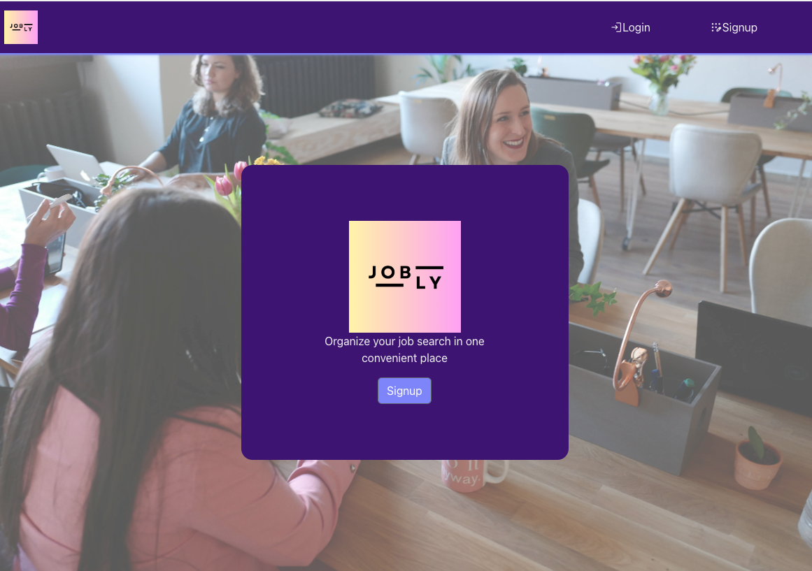

# Jobly 

## Description: 

This application is a responsive React front end for my Jobly API(https://github.com/suchisundar/jobly-backend), which works together to create a mock job search site. Users can search and view different mock companies and jobs based on certain criteria, and "apply" to those jobs with the click of a button.

Check it out here: https://react-jobly-frontend-0jf1.onrender.com

This project was bootstrapped with [Create React App](https://github.com/facebook/create-react-app). This project uses [Bootstrap 5](https://getbootstrap.com/) and [react-strap](https://github.com/reactstrap/reactstrap) components for much of its CSS. And I combined reactstrap elements with [React Hook Form](https://react-hook-form.com/get-started/) for all of my form components. Client side routing is handled by [react-router-dom v6](https://www.npmjs.com/package/react-router-dom) and HTTP requests for AJAX functionality is done using the [Axios](https://github.com/axios/axios) library. The back end API was written in Node using the Express web framework and a PostgreSQL database.

## Tools Used: 

* [React.js](https://reactjs.org/)
* [Reactstrap](https://reactstrap.github.io/?path=/docs/home-installation--page)
* [React Hook Form](https://react-hook-form.com/get-started/)

## Installation
After cloning the repository, install all dependencies by executing `npm install` within the top level project directory. This program requires the use of an external API to function.

If you wish to run this API locally on your machine, this app expects the Jobly API to be listening on **port 3001** of localhost; make sure to set the port number of the localhost URL in `api.js` if your local deployment of the API is listening on a different port. With your local API set up, start the frontend of the app in developer mode on localhost 3000 with the following command:
### `npm start`
